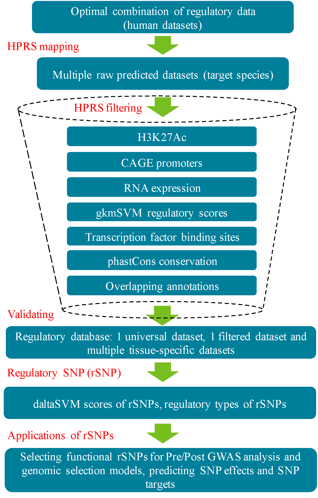

# HPRS (Human Projection of Regulatory Sequences) pipeline
HPRS is a computational pipeline that enables the utilization of genomic and epigenomic data from human genome to predict functional regulatory genomic regions in production animals and can be extended to other mammalian species. Results of the pipeline can contribute to improving pre/post GWAS analysis and genomic prediction models, and understanding functional mechanisms of regulatory elements and DNA variants.

The pipeline has been developed and tested by Dr. Quan Nguyen, Prof. Brian Dalrymple and colleagues. Comments are very welcome and can be sent to the emails: quan.nguyen@uq.edu.au and brian.dalrymple@uwa.edu.au.

The HPRS pipeline has three main steps, which are arranged in this site into three  main folders (in sequential order of the pipeline):  start with programs in the Map folder, then in Filter folder, and then in RegulatorySNP folder. Each of these folders contains all Python/R/Shell scripts needed for running the programs. One additional Data folder contains data for testing, and a table with information on URLs to download publically available data for use in the pipeline. The Utilities directory contain optional, common commands, convenient to run the pipeline. Each folder also contains step-by-step instructions. Figure 1 below describes the workflow.

  

Figure 1. HPRS streamlined workflow for the prediction of regulatory regions. Key steps include mapping human regulatory regions to a target genome (creating a universal dataset), filtering the mapped regions by seven epigenomic, transcriptomic and genomic criteria to keep only regions with potential regulatory functions, validating the predicted regions by comparing with known reference dataset, and translating the findings to potential applications in genomic technology.

#### For more information, please refer to our preprint bioRxiv article (The article has been accepted for publication at *GigaScience*):

Nguyen, Q.H., Tellam, R.L., Naval-Sanchez, M., Porto-Neto, L., Barendse, W., Reverter, A., Hayes, B., Kijas, J., and Dalrymple, B.P. (2017). Mammalian genomic regulatory regions predicted by utilizing human genomics, transcriptomics and epigenetics data. *bioRxiv* 143990; doi: https://doi.org/10.1101/143990

#### Data and code are also available at *GigaScience Database*:

Nguyen, Q, H; Tellam, R, L; Naval-Sanchez, M; Porto-Neto, L, R; Barendse, W; Reverter, A; Hayes, B; Kijas, J; Dalrymple, B, P (2017): Supporting data for "Mammalian genomic regulatory regions predicted by utilizing human genomics, transcriptomics and epigenetics data" GigaScience Database.http://dx.doi.org/10.5524/100390

